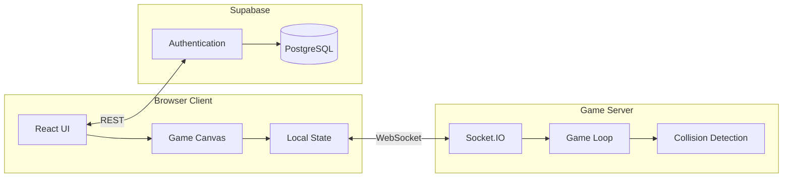

# Pixel Down

### Real-Time Multiplayer Pixel Arena Game

  
    Web Introduction Class - Final Project
  

  pixel-down.vercel.app

---

# Project Overview

### What is Pixel Down?

A browser-based multiplayer arena shooter where players compete in real-time matches. Features both online multiplayer and an offline mode with AI opponents.

**Core Concept:**
- Fast-paced combat gameplay
- Coin-based economy system
- In-game shop with power-ups
- Persistent player statistics

---

# Tech Stack

### Frontend

| Technology | Purpose |
|------------|---------|
| Next.js 15 | React framework |
| TypeScript | Type safety |
| Tailwind CSS | Styling |
| HTML Canvas | Game rendering |

### Backend

| Technology | Purpose |
|------------|---------|
| Node.js | Server runtime |
| Socket.IO | Real-time sync |
| TypeScript | Type safety |

### Architecture

- WebSocket connections for live gameplay
- REST API for authentication
- PostgreSQL for data persistence

---
layout: center
---

# System Architecture

---

# Multiplayer Mode

### Features

- Create or join game rooms with unique IDs
- Real-time player position synchronization
- Server-authoritative game state
- Up to 10 players per match
- 10-minute match duration
- Live leaderboard updates

### How It Works

1. Player creates a room or joins with ID
2. Socket.IO establishes WebSocket connection
3. Server runs game loop at 60 FPS
4. Client sends inputs, receives game state
5. Canvas renders interpolated positions

---

# Offline Mode

### Bot System

When the backend server is unavailable, players can still enjoy the game against bot opponents.

**Bot Behavior:**
- Patrol state: Random movement
- Chase state: Follow player within range
- Attack state: Stop and shoot at player

**Bot Parameters:**
- Chase range: 600 pixels
- Attack range: 250 pixels
- Stop distance: 120 pixels
- Spawn interval: 20 seconds

---

# Combat and Economy

### Combat System

- Click to shoot projectiles
- Projectiles travel in aim direction
- Each kill awards 50 coins
- 5-second respawn timer
- Health: 100 HP
- Mana: 100 (regenerates)

### Coin Drops

- Coins drop where enemies die
- Walk over coins to collect
- 30-second expiration timer
- Coins saved to database
- Persist between sessions

### Shop Buffs

| Buff | Cost | Effect |
|------|------|--------|
| Speed | 50 | +50% movement |
| Mana | 75 | +100% regen |
| Power | 100 | +100% damage |
| Shield | 60 | -25% damage taken |

---

# Authentication

### Supabase Integration

- Email and password authentication
- Email verification required
- Secure session management
- Automatic token refresh

### Database Schema

**player_stats table:**
- user_id (UUID)
- coins (integer)
- total_kills (integer)
- games_played (integer)

**matches table:**
- match_id, created_at, duration
- match_players (join table)

---

# Backend Health Detection

### Smart Fallback

The application automatically detects backend availability and adjusts the UI accordingly.

**When Online:**
- Show "Create Game" button
- Show "Join Game" option
- Enable multiplayer features

**When Offline:**
- Display warning banner
- Show "Play Offline" button
- Bot mode available

### Implementation

- Health check on page load
- 2 retry attempts
- 2-second timeout per attempt
- Graceful degradation

---

# Game Canvas

### Rendered Elements

| Element | Description |
|---------|-------------|
| Players | Colored cubes with aim indicator |
| Bots | Red cubes with programmed behavior |
| Projectiles | Small circles traveling |
| Obstacles | Gray rectangular blocks |
| Shops | Glowing circular areas |
| Coins | Yellow collectibles |

### Camera System

- Viewport: 1600 x 1066 pixels
- Arena size: 2400 x 1600 pixels
- Camera follows player center
- Smooth scrolling at edges

---

# Challenges and Solutions

### Challenges

1. **State synchronization** - Keeping all clients in sync with server state

2. **Next.js hydration** - Canvas component caused SSR mismatch errors

3. **Bot AI tuning** - Bots were either too aggressive or too passive

4. **Input handling** - Keyboard events conflicting with UI elements

5. **Performance** - Canvas redraw causing frame drops

### Solutions

1. **Server-authoritative model** - Server is source of truth, clients interpolate

2. **Dynamic imports** - Load game component only on client side

3. **State machine** - Separate patrol/chase/attack behaviors with ranges

4. **Focus management** - Proper event listener cleanup and dependencies

5. **RequestAnimationFrame** - Delta time for consistent updates

---

# Live Demo

### Try it now

  pixel-down.vercel.app

**Create Account**

1. Visit the website
2. Click Get Started
3. Enter email and password
4. Verify your email

**Play Multiplayer**

1. Click Create Game
2. Share the game ID
3. Wait for others to join
4. Start the match

**Play Offline**

1. Click Offline Mode
2. Fight against bots
3. Collect coins from kills
4. Buy power-ups at shop

---

# Future Vision

### Crypto Token Integration

If we scale this project, the in-game coins could become a cryptocurrency token deployed on **Solana**.

- Fast transactions, low fees
- Players own their coins
- Trade coins outside the game
- Real value for gameplay rewards

### Player Avatars

Unique player avatars that can be purchased to stand out from other players.

- Custom skins and colors
- Rare and limited editions
- Marketplace for trading
- Show off your style in matches

---
layout: center
class: text-center
---

# Thank You

  Questions?

**GitHub:** github.com/Samer-Gassouma/Pixel-down

**Live:** pixel-down.vercel.app

